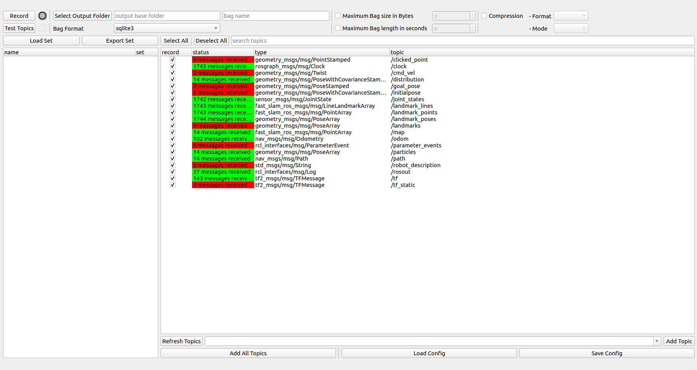

# RQT Bag recorder

This package implements an rqt plugin that helps recording bags in a nice and easy way. The basic idea for this plugin comes from the problem many teams face when data gathering is conducted by someone else than the one interested in the data. This plugin gives the person who is doing the recording all the tools to make informed decisions, debug the current system and run through tasks quick and easy. It is also taking away the responsibility of painstakingly setting up scripts and commands by hand and puts it on the stakeholder that requested the data.

Besides this, the tool can also be handy in quick recording sessions when the user does not want to fumble with the command line interface.

## Package inspiration

This package is of course inspired by the ros native `rqt_bag` [repo](https://github.com/ros-visualization/rqt_bag/tree/humble).

## Installing and running the plugin:
```
mkdir -p ws/src
cd ws/src
git clone git@github.com:yschulz/rqt_bag_recorder.git
cd ..
colcon build
source install/setup.bash

rqt --force-discover
```

## Using the plugin

### Direct use:

1. As a first step, topics need to be added to the scope. One can add all topics that are currently being published in ros by clicking on *Add All Topics*. If it is desired to not clutter the list view, topics can also be added one by one by selecting them in the drop down menu and clicking *Add Topic*. As a third way, a single configuration file can be loaded from the file system. Loading it this way, only the subset specified in the configuration file is loaded into the list view on the right.

2. Once a set of topics are in the list view, one can briefly check if the specified topics are up and there is a publisher broadcasting data. Clicking *Test Topics* counts all messages coming in for the displayed topics in a 2 second window. The status column will show the amount of messages received and can give an indication to the user what he can expect.



3. Before one can record, a base folder and a bag name have to be specified. By clicking *Select Output Folder* one can specify a folder in their file system. A new bag name can be simply typed into the text field. Should the bag name alredy exist as a folder, the text box will turn **red** and recording will be blocked. Optionally, recorder parameter can be specified according to the generic `ros2 bag record` arguments on the top right.

4. Before recording like this, it is now a good idea to save this particular configuration as a config file, either for future reference or for recording it again. To do so, one can open a save dialog by clicking *Save Config*.


5. Now, a click on *Record* will start the recording of the bag file. This will trigger the recording indicator and all topic fields will give an indication about their status under the status column. Clicking again on the same button (which is now reading *Stop*) will stop the recording. A bag will be created at the specified location and as a result the bag_name text box will now turn red, as the bag folder already exists.

### Use via configurations:

1. If there are multiple bags to be recorded, multiple configuration files can be dumped into a folder before going out to test and record. Loading this set of configuration files can be done by clicking *Load Set* on the left hand side of the plugin. Selecting and opening the folder will open multiple elements insdie the left list view, each element corresponding to the configuration files in the folder.


2. This list view gives the user easy access and instructions for the tasks at hand. Each configuration can be added with a *discription* field that leaves instructions about the test setup for the user. The discription can be accessed through the drop down arrow next to the file name.

3. The *Set* button next to the filename lets the user easily swap between recording tasks that were defined inside the configuration files.